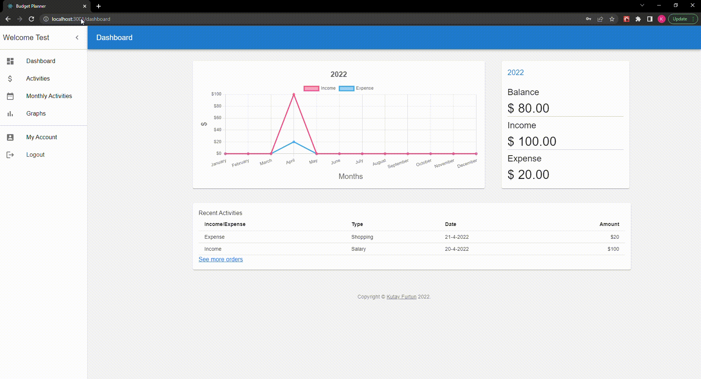
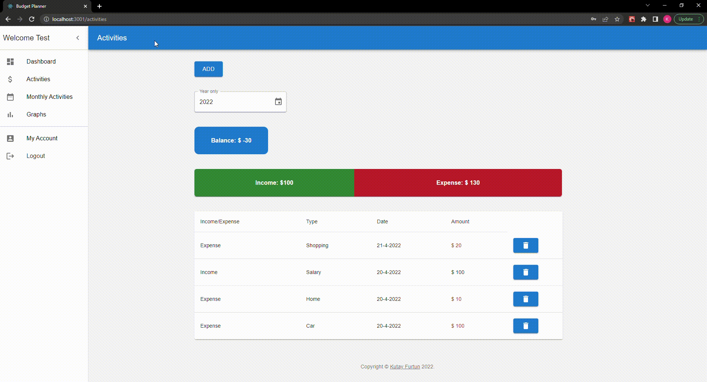
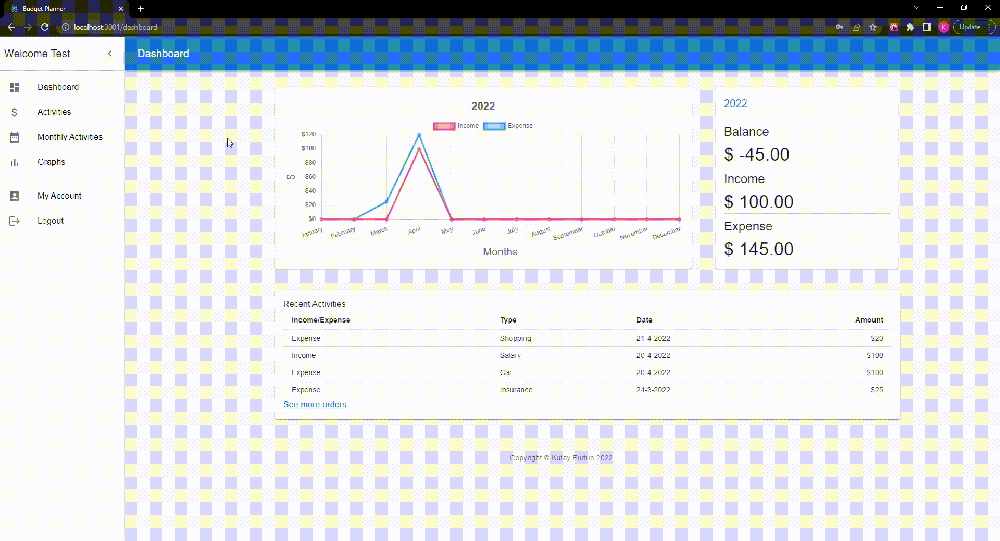

# Budget Planner App

## Introduction

This is a web app that allows users to organize their budget. Users can login, enter their expenses and income, visualize their budget with graphs and pie charts. This app has not been published yet. The purpose of this project is to develop a web app, improve and practice my React, NodeJS and MS SQL skills.

## Built with

- React
- NodeJS
- MS SQL

## Features/Technologies used

- React Router Dom
- Chart.js
- Recoil
- Styled Components
- MUI
- Moment.js
- Express.js
- Nodemailer

## Screenshots

### Sign-up

### Sign-in

### Dashboard and Activities

### Monthly Activities

### Graphs

More loading...
